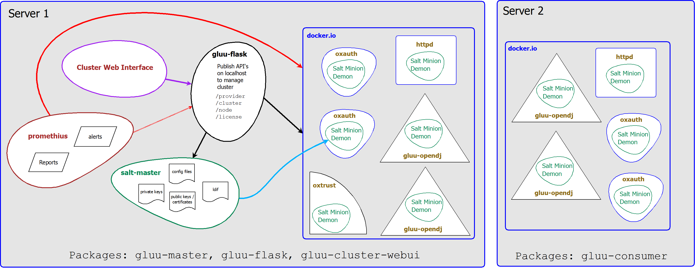

# Overview

[TOC]

Gluu Docker Edition promises scalability, reliability and a fail-over mechanism through its innovative design implemented using [Docker](https://www.docker.com/). [DE][de] can also call a DOS service, like [DOSarrest](http://www.dosarrest.com/), enabling protection from distributed denial of service attacks.
The [DE][de] package deploys the Gluu Server access management suite, which is capable of authenticating and authorizing users with both the SAML and OpenID Connect protocols. We recommended trying a single Gluu Server deployment first for testing as the [DE][de] packages require a commercial license.

An overview of the Gluu Server is available [here](http://www.gluu.org/docs/admin-guide/getting-started/).

## Design

The Gluu Docker Edition has two principle compoents that are interdependent, the master and the consumer.
The master package must be installed for the cluster to be functional, and without the master package, the consumer will not work.
The installation instructions are available in the [Installation Docs](../installation/).

The diagram above shows the design structure of Gluu [DE][de]. The components are held together in various docker containers, accessed using the `gluu-flask` which has a separate User Interface that can be used to manage the cluster. Prometheus is the monitoring system for the cluster providing real-time reports on the containers.

## Functionalities

The core functionalities of the Gluu Server is available in the [DE][de] design with a few additional features such as cluster monitoring, DDOS protection and a fail-safe system.
The Cluster monitoring system uses Prometheus for alerts and reports on the nodes in real-time.
The cluster administrator can use the dashboard to check on the health and activity, view logs and other Gluu Server administration tasks. The Gluu Server Administration Guide is available [here](http://www.gluu.org/docs/admin-guide/introduction/).

## Supported Operating Systems

The following __64-bit__ operating systems are supported by cluster:

* Ubuntu Trusty (14.04)

_Note_:

* 32-bit operating systems are __not__ supported.
* At least kernel 3.10 at minimum.

## Hardware Requirements

At minimum, the recommended resources for each server in cluster are:

* 4 CPU Units
* 8 GB of RAM
* 80 GB of disk space

## Components

The Gluu Cluster takes advantage of the latest free, open-source, components which work together to provide a hickup-free cluster environment.
The components are listed in the [components page](../components/#components).

[de]: "Docker Edition"
