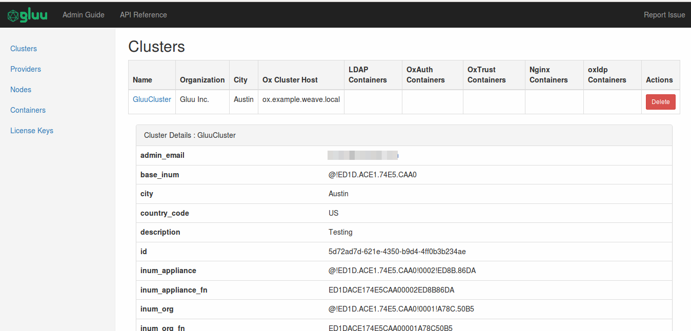
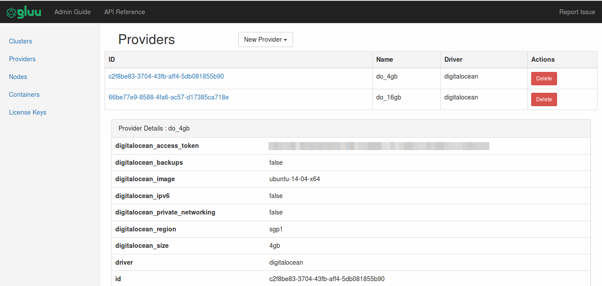
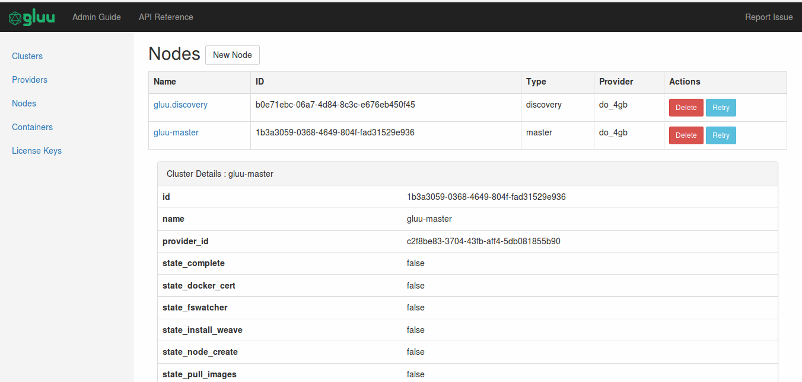
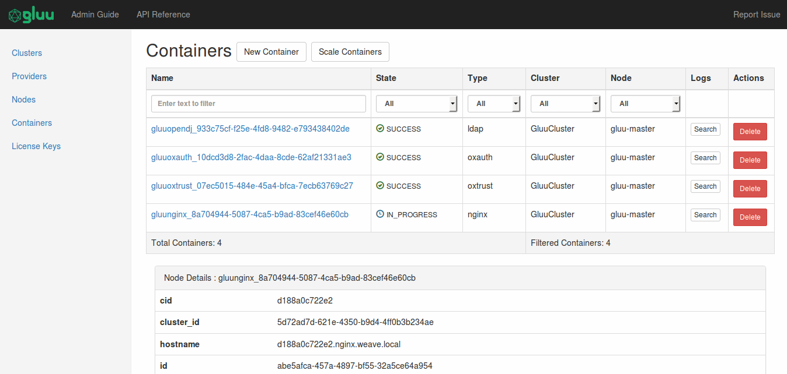
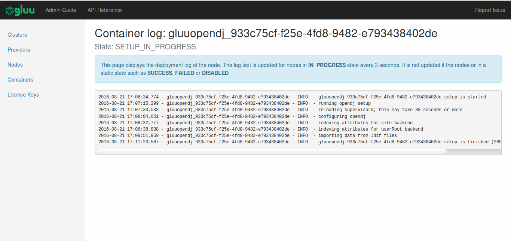
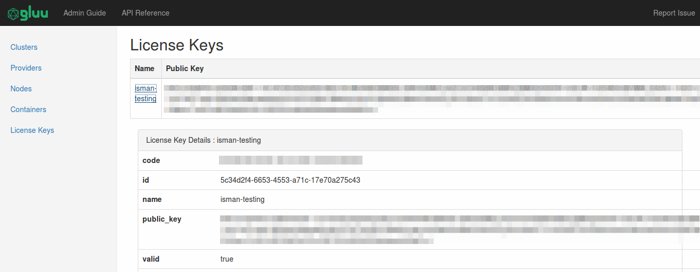
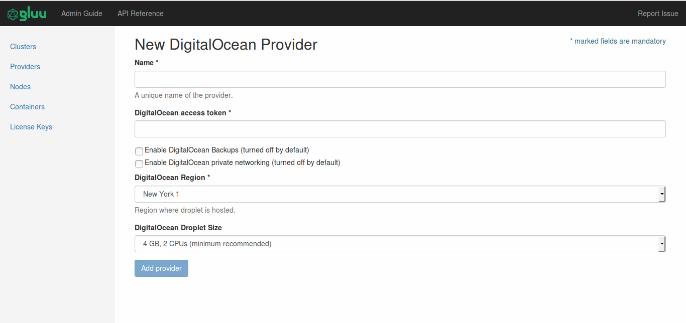
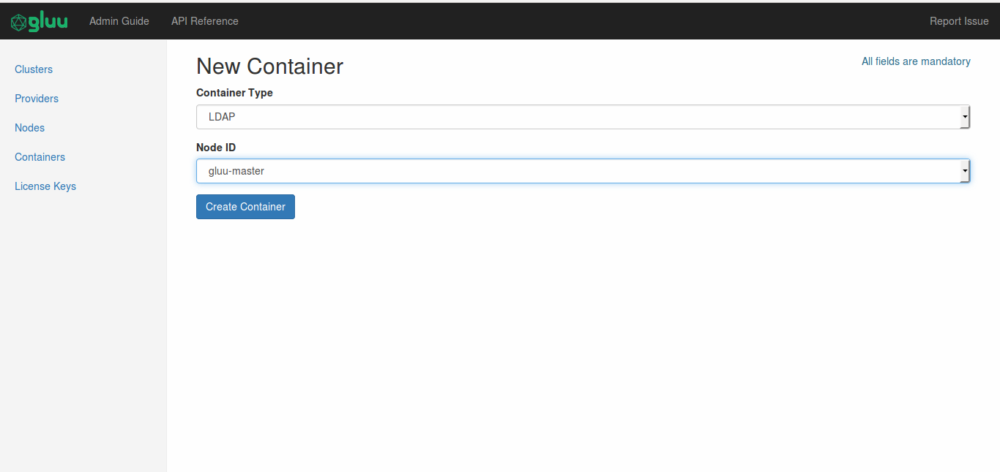
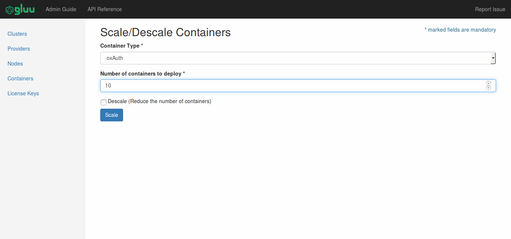
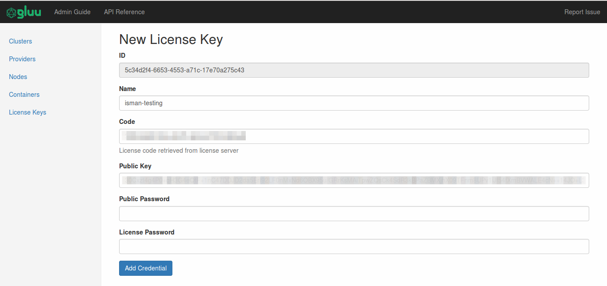

[TOC]
# Cluster Management using Web Interface

The web interface provides a user friendly way of using the API and managing the various resources of the cluster.

## Installation
The installation of the web interface is covered in the Installation Section.

* [Install Web Interface Package](../installation/#installing-gluu-engine-and-gluu-webui-image)

## Accessing the Interface
To log into the web interface, it is necessary to ssh into the control machine, as the interface is run locally and it is not facing the internet for security reasons.

Run the following command to SSH for accessing the web interface:

`ssh -L 8800:localhost:8800 <ssh-user>@<ssh-host>`

Point your browser to the following address to access the webui:

`http://localhost:8800`

When you access the web interface, the following screen will appear.

## Using the Web Interface
### The overview page

The overview page consists of a table which lists all the entities of that particular resource type, with their most important details (each item in the table has clickable link to expand the details) and their associated actions if any.

If the API provides only POST and DELETE actions then the interface provides a 'New RESOURCE' button on top and a 'DELETE' button for each resource in the table.

#### Cluster Overview

#### Provider Overview

#### Node Overview

Node deployment might be interrupted in the middle of the process, hence there's also __Retry__ button
to continue the deployment process.

#### Container Overview

The table for container list is filterable.

Each container has its own deployment log. To access the log, user need to click the __Search__ button first.
A new __Setup__ button will appear and it will take the user to the specified log, as seen below:

#### License Overview

### Adding/Editing Resources

New resources can be added by clicking the 'New RESOURCE' buttons in the overview pages. This takes you to the form where all the values required for that particular resource can put entered. Submitting the form requests the API for action. If the resource creation is successful, you are taken back to the overview page and you can see the new resource listed in the overview table.

#### Adding New Resource

In this example, the provider will be hosted at DigitalOcean.

To add new container, user need to choose the type and node to host the container.

Scaling containers can be done for oxAuth container only. A given number of oxAuth containers will be deployed to existing master and worker nodes.

#### Editing Existing Resource

Existing resources can be altered when they provide an Edit action. Clicking the Edit button takes you to the edit form which is similar to the 'New' form with the ID of the existing resource disabled. ID's are unique system generated strings and hence disabled from editing.

## History

All the create requests made by the Web UI is saved in the file called  `config-history.log`. Each post request generate 3 lines of log:

1. The date and time of logging
2. The cUrl command equivalent of the POST request made from the web interface
3. The status code of the response provided by the API server

The log can be accessed from the browser at `http://localhost:8800/static/config-history.log`
