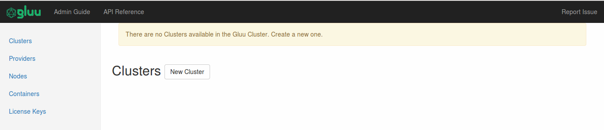

[TOC]
# Cluster Management using Web Interface

The web interface provides a user friendly way of using the API and managing the various resources of the cluster.

## Installation
The installation of the web interface is covered in the Installation Section.

* [Install Web Interface Package](../installation/#installing-gluu-engine-and-gluu-webui-image)

## Accessing the Interface
To log into the web interface, it is necessary to ssh into the control machine, as the interface is run locally and it is not facing the internet for security reasons.

Run the following command to SSH for accessing the web interface:

`ssh -L 8800:localhost:8800 <ssh-user>@<ssh-host>`

Point your browser to the following address to access the webui:

`http://localhost:8800`

## Using the Web Interface

### Managing Cluster

When we access the interface for the first time, the following screen will appear:

To create a new cluster, click the "New Cluster" button. A new form with various fields will appear:

Each field is mandatory, except "Description".

In the screen above, we use `ox.example.weave.local` as an example of cluster domain.
To access the cluster, type `https://ox.example.weave.local` in browser's address bar.
In production, use our actual domain instead, e.g. `my-gluu-cluster.com`.
Note, this domain must be resolvable via DNS; otherwise the cluster will not work as expected.

Please remember, all URLs must be prefixed with `https`. That means we need to provide SSL certificate and key.
In Gluu Server Docker Edition, the certificate and key are called `nginx.crt` and `nginx.key` respectively, as we are using `nginx` as frontend.
So for example, if we have `my-ssl.crt` and `my-ssl.key`, we need to rename them into `nginx.crt` and `nginx.key`.
Afterwards, put them under `/var/lib/gluuengine/ssl_certs` directory (create the directory if not exist).

Now back to cluster overview.

As we have created a new cluster, a table will appear showing existing cluster information.
To see the details, click the link under "Name" header row. A new table will appear below the main table.
To delete the cluster, click the "Delete" button (the red box) under "Actions" header row.

Now we can continue creating Provider.

### Managing Provider

[TBA]

### Managing Nodes

[TBA]

### Managing Container

[TBA]

### Managing License Key

[TBA]

## History

All the create requests made by the Web UI is saved in the file called  `config-history.log`. Each post request generate 3 lines of log:

1. The date and time of logging
2. The cUrl command equivalent of the POST request made from the web interface
3. The status code of the response provided by the API server

The log can be accessed from the browser at `http://localhost:8800/static/config-history.log`
